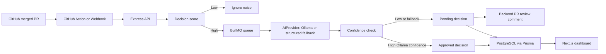
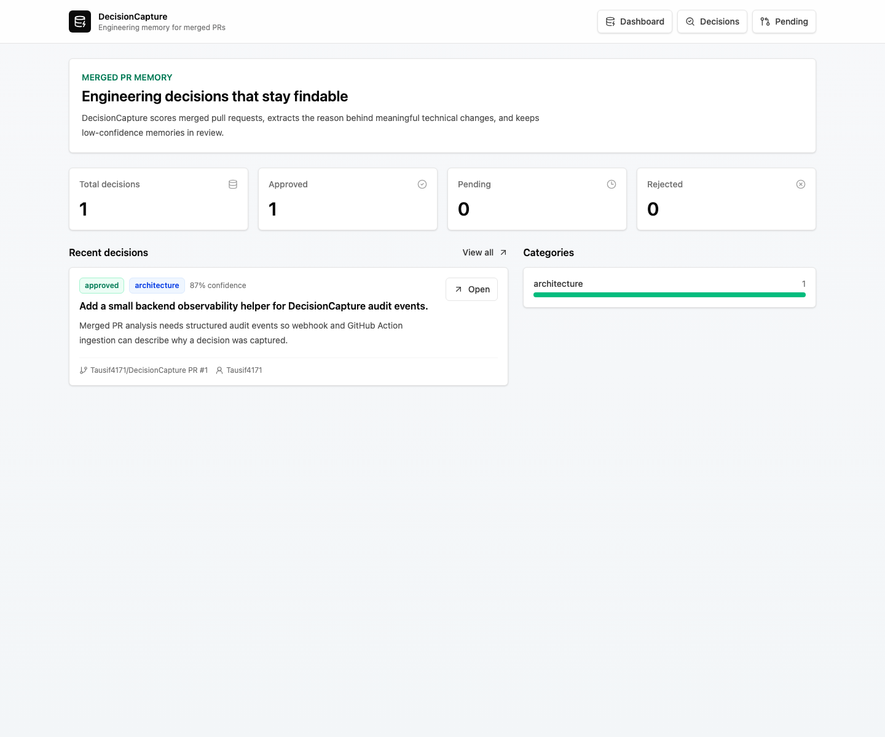
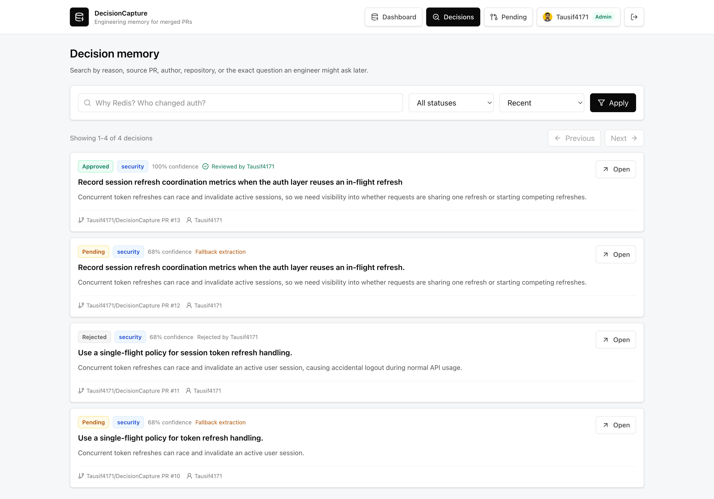
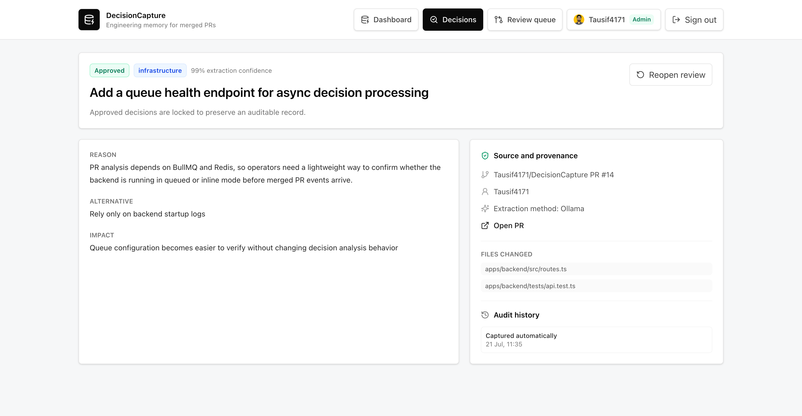
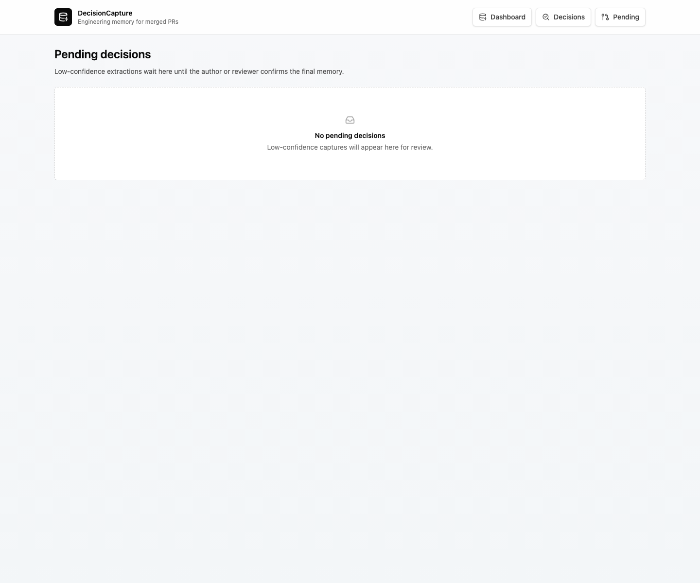

# DecisionCapture

DecisionCapture is an engineering memory system that captures important technical decisions from merged GitHub pull requests.

Code shows what changed. PR discussions explain why. DecisionCapture preserves that reasoning before it disappears into old GitHub threads.

## What It Does

- Accepts merged PR context from GitHub webhooks or the included GitHub Action.
- Enriches webhook-only ingestion with full PR files, commits, reviews, comments, approvals, and a bounded diff summary through the GitHub API.
- Scores PRs before AI analysis so low-value noise is ignored.
- Extracts decision, reason, alternative, impact, author, source PR, confidence, and category.
- Stores approved and pending decision memories in PostgreSQL.
- Processes capture work asynchronously with BullMQ and Redis.
- Uses an `AIProvider` abstraction with Ollama plus a conservative structured-PR fallback that never invents canned decisions.
- Posts and updates PR review comments from the backend when a decision needs review or is later approved, rejected, or reopened.
- Tags the PR author on pending review comments and includes normal PR conversation comments in analysis context.
- Supports GitHub OAuth, role-based review permissions, reviewer identity, and a persistent decision audit trail.
- Provides a dashboard for search, detail review, and pending approval.

## Architecture



## Screenshots

### Dashboard



### Search And Review List



### Decision Detail



### Pending Queue



## Repository Layout

```text
decisioncapture/
  apps/
    backend/      Express, Prisma, BullMQ, GitHub ingestion, AI extraction
    frontend/     Next.js dashboard, search, detail, pending review
  packages/
    shared/       Shared TypeScript contracts
  .github/
    workflows/    GitHub Action for merged PR ingestion
```

## Quick Start With Docker

Docker is the easiest path.

```bash
cd /Users/tausif/Documents/projects/decisioncapture
cp .env.example .env
docker compose up -d
docker compose exec ollama ollama pull llama3.1
```

Open:

- Frontend: http://localhost:3088
- Backend health: http://localhost:4000/health

Run the local demo PR:

```bash
curl -X POST http://localhost:4000/demo/pr
```

Stop the stack:

```bash
docker compose down
```

Reset all local data:

```bash
docker compose down -v
docker compose up -d
```

The Docker stack runs `npm run db:push` on startup so the MVP schema stays aligned with the current Prisma model.

## Local Development

```bash
cd /Users/tausif/Documents/projects/decisioncapture
cp .env.example .env
npm install
npm run db:generate
npm run db:push
npm run dev
```

For non-Docker development, provide PostgreSQL and Redis matching `.env.example`, or point `DATABASE_URL` and `REDIS_URL` at your own services.

## Environment Variables

| Variable | Purpose |
| --- | --- |
| `POSTGRES_DB` | Local or Docker PostgreSQL database name. |
| `POSTGRES_USER` | Local or Docker PostgreSQL username. |
| `POSTGRES_PASSWORD` | Local or Docker PostgreSQL password. |
| `DATABASE_URL` | PostgreSQL connection string for Prisma. |
| `REDIS_URL` | Redis connection string for BullMQ. |
| `QUEUE_MODE` | `inline` for local direct processing, `bullmq` for queued processing. |
| `QUEUE_WORKER_ENABLED` | Starts the worker inside the backend process when true. |
| `FRONTEND_ORIGIN` | Allowed frontend origin for CORS and dashboard links. |
| `APP_BASE_URL` | Public dashboard base URL used in PR review comment links. |
| `AUTH_MODE` | `disabled` for local/demo access or `github` to require GitHub sign-in for review actions. |
| `AUTH_SESSION_SECRET` | Secret used to sign dashboard sessions. Required and at least 32 characters when GitHub auth is enabled. |
| `AUTH_ALLOWED_LOGINS` | Comma-separated GitHub logins allowed to sign in as `VIEWER`; role-assigned logins are allowed automatically. |
| `AUTH_ADMIN_LOGINS` | Comma-separated GitHub logins that receive the `ADMIN` role. |
| `AUTH_MAINTAINER_LOGINS` | Comma-separated GitHub logins that receive the `MAINTAINER` role. |
| `AUTH_REVIEWER_LOGINS` | Comma-separated GitHub logins that receive the `REVIEWER` role. |
| `GITHUB_CLIENT_ID` | GitHub OAuth App client ID for dashboard sign-in. |
| `GITHUB_CLIENT_SECRET` | GitHub OAuth App client secret for dashboard sign-in. |
| `GITHUB_WEBHOOK_SECRET` | HMAC secret for GitHub webhook signature verification. Replace the sample value before real webhook use. |
| `GITHUB_API_TOKEN` | GitHub PAT or GitHub App installation token used to enrich webhook payloads and post or update PR review comments. |
| `GITHUB_APP_ID` | Preferred GitHub App ID for short-lived bot authentication. Configure with installation ID and private key. |
| `GITHUB_APP_INSTALLATION_ID` | Installation ID for the DecisionCapture GitHub App. |
| `GITHUB_APP_PRIVATE_KEY` | GitHub App PEM private key. In `.env`, encode line breaks as `\n`. |
| `INGEST_API_TOKEN` | Token required by `/decisions/analyze` when you set one. |
| `AI_PROVIDER` | `ollama` or `heuristic`. |
| `OLLAMA_BASE_URL` | Ollama API URL. In Docker this is `http://ollama:11434`. |
| `OLLAMA_MODEL` | Ollama model name, default `llama3.1`. |
| `OLLAMA_REQUEST_TIMEOUT_MS` | Maximum extraction time in milliseconds. Default `120000` supports local CPU inference. |
| `USE_HEURISTIC_AI_FALLBACK` | Parses explicit Decision/Reason/Alternative/Impact PR sections if Ollama is unavailable. Fallback records always require review. |
| `NEXT_PUBLIC_API_URL` | Browser-facing backend URL for the frontend. |

To use a real Ollama model in Docker:

```bash
docker compose exec ollama ollama pull llama3.1
```

Pulling the model is required for real AI extraction. Without it, the backend safely creates a pending draft only from explicit PR sections and honest missing-context placeholders; it never auto-approves fallback output.

## API

- `POST /github/webhook` receives GitHub `pull_request.closed` events and only analyzes merged PRs.
- `POST /decisions/analyze` accepts full PR context from the GitHub Action or manual ingestion and normally queues work asynchronously. Add `?wait=true` only for manual debugging when you want the processed result immediately.
- `GET /decisions` searches decisions by keyword, status, repository, category, and sort.
- `GET /decisions/stats` returns dashboard metrics and recent decisions.
- `GET /decisions/:id` returns a decision detail record.
- `GET /decisions/:id/audit` returns the decision review audit trail.
- `PATCH /decisions/:id` saves edits while leaving a decision pending.
- `PATCH /decisions/:id/approve` approves a pending decision and optional edits.
- `PATCH /decisions/:id/reject` rejects a pending decision.
- `PATCH /decisions/:id/reopen` reopens an approved or rejected decision with a required audit reason. With GitHub auth enabled, only admins and maintainers may use it.
- `GET /auth/me` returns the current dashboard authentication state.
- `GET /auth/github` starts GitHub OAuth login and `GET /auth/github/callback` completes it.
- `POST /auth/logout` clears the dashboard session.
- `POST /demo/pr` queues a sample merged PR for local demo testing.

## GitHub Integration

The included workflow runs only for:

```yaml
pull_request:
  types: [closed]
```

It also checks:

```yaml
if: github.event.pull_request.merged == true
```

Configure repository secrets:

- `DECISIONCAPTURE_API_URL`, for example `https://your-api.example.com`
- `DECISIONCAPTURE_TOKEN`, matching `INGEST_API_TOKEN`

Configure backend environment variables for GitHub-owned enrichment and PR feedback:

- Preferred: `GITHUB_APP_ID`, `GITHUB_APP_INSTALLATION_ID`, and `GITHUB_APP_PRIVATE_KEY`. DecisionCapture creates short-lived installation tokens and comments appear under the GitHub App bot identity.
- MVP fallback: `GITHUB_API_TOKEN`, a PAT with access to the repositories you want to analyze. Comments appear as the PAT owner.
- `APP_BASE_URL`, the public dashboard URL used in PR review links

For the GitHub App, grant repository metadata read access and pull requests read/write access, then install it on the repositories DecisionCapture should analyze. Keep OAuth App credentials for human dashboard sign-in separate from GitHub App credentials for backend automation.

The workflow collects PR metadata, a bounded diff summary, formal reviews, normal PR conversation comments, labels, approvals, and changed files, then sends that payload to `POST /decisions/analyze` without waiting for inline processing. The BullMQ worker owns analysis, author-tagged pending review comment creation, and later PR comment updates when a reviewer approves or rejects the decision from the dashboard.

If you want to test this from a local machine, expose the backend with a tunnel and use that public URL as `DECISIONCAPTURE_API_URL`. Set `APP_BASE_URL` to a reachable dashboard URL if you want PR comments to contain clickable review links.

For direct webhooks, set the GitHub webhook secret to match `GITHUB_WEBHOOK_SECRET`. With `GITHUB_API_TOKEN` configured, webhook-only ingestion fetches the same rich PR context the requirements call for instead of relying on the limited webhook payload alone.

## Dashboard Authentication And RBAC

Local/demo mode remains open by default:

```env
AUTH_MODE=disabled
```

For a protected dashboard, create a GitHub OAuth App and set its callback URL to the public backend URL plus `/auth/github/callback`. For local testing, use:

```text
http://localhost:4000/auth/github/callback
```

Then configure:

```env
AUTH_MODE=github
AUTH_SESSION_SECRET=replace-with-at-least-32-random-characters
GITHUB_CLIENT_ID=your-oauth-client-id
GITHUB_CLIENT_SECRET=your-oauth-client-secret
AUTH_ALLOWED_LOGINS=
AUTH_ADMIN_LOGINS=Tausif4171
AUTH_MAINTAINER_LOGINS=
AUTH_REVIEWER_LOGINS=
```

Generate a session secret with `openssl rand -hex 32`. Restart or rebuild the backend after changing these values.

Review permissions are enforced by the backend:

- Only GitHub logins present in `AUTH_ALLOWED_LOGINS` or one of the role lists can sign in.
- `ADMIN`, `MAINTAINER`, and `REVIEWER` users can edit, approve, or reject any pending decision.
- Only `ADMIN` and `MAINTAINER` users can reopen an approved or rejected decision; reopening requires a reason and returns the record to pending review.
- A `VIEWER` can review a decision only when their GitHub login matches the PR author, a requested/reported reviewer, or an approver captured from the PR.
- Unauthenticated users receive `401` for dashboard data and review actions when GitHub auth is enabled. Ingestion remains protected separately by `INGEST_API_TOKEN`.
- Unauthorized signed-in users receive `403`.

Each edit, approval, rejection, and reopen is stored with the actor and before/after state. Decision cards show one status plus muted reviewer attribution, while the detail page shows the complete audit history. GitHub API/App credentials remain backend service credentials for PR enrichment/comments; they are separate from OAuth client credentials used for human dashboard sign-in.

## Verification

Recommended local verification:

```bash
npm run typecheck
npm run lint
npm run test
npm run build
npm run test:e2e
docker compose config
docker compose up -d
curl http://localhost:4000/health
curl -X POST http://localhost:4000/demo/pr
curl http://localhost:4000/decisions
```

The Playwright command starts an isolated Docker stack on ports `3098` and `4010`, uses an ephemeral PostgreSQL database, and removes the stack and data after the run. It does not add synthetic PRs to your normal dashboard database. Set `E2E_USE_EXISTING_STACK=true` only when intentionally testing an already-running environment.

Recommended end-to-end verification is a merged GitHub PR through `.github/workflows/decisioncapture.yml`. Keep the backend and tunnel running, set `DECISIONCAPTURE_API_URL` and `DECISIONCAPTURE_TOKEN` in GitHub Actions secrets, merge a PR, then confirm the dashboard shows that real PR.

For webhook-only verification, also set `GITHUB_WEBHOOK_SECRET` and `GITHUB_API_TOKEN` on the backend, point a GitHub webhook at `POST /github/webhook`, merge a PR, and confirm the stored decision includes real files, commits, reviewers, approvals, and diff-derived context.

## Future Memory Store MCP Integration

DecisionCapture is standalone today. A future integration can export approved decision memories into Memory Store MCP:

```text
DecisionCapture -> Memory Store MCP -> Company Memory
```

That integration should be an optional output adapter. The core MVP does not depend on Memory Store APIs.
