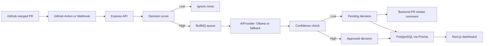

# DecisionCapture

DecisionCapture is an engineering memory system that captures important technical decisions from merged GitHub pull requests.

Code shows what changed. PR discussions explain why. DecisionCapture preserves that reasoning before it disappears into old GitHub threads.

## What It Does

- Accepts merged PR context from GitHub webhooks or the included GitHub Action.
- Enriches webhook-only ingestion with full PR files, commits, reviews, comments, approvals, and a bounded diff summary through the GitHub API.
- Scores PRs before AI analysis so low-value noise is ignored.
- Extracts decision, reason, alternative, impact, author, source PR, confidence, and category.
- Stores approved and pending decision memories in PostgreSQL.
- Processes capture work asynchronously with BullMQ and Redis.
- Uses an `AIProvider` abstraction with Ollama plus a deterministic local fallback.
- Posts and updates PR review comments from the backend when a decision needs review or is later approved/rejected.
- Provides a SaaS-style dashboard for search, detail review, and pending approval.

## Architecture



## Screenshots

### Dashboard


### Search And Review List


### Decision Detail


### Pending Queue


## Repository Layout

```text
decisioncapture/
  apps/
    backend/      Express, Prisma, BullMQ, GitHub ingestion, AI extraction
    frontend/     Next.js dashboard, search, detail, pending review
  packages/
    shared/       Shared TypeScript contracts
  .github/
    workflows/    GitHub Action for merged PR ingestion
```

## Quick Start With Docker

Docker is the easiest path. Create a local `.env` first so the ingest API uses your real secret token instead of any committed value.

```bash
cd /Users/tausif/Documents/projects/decisioncapture
cp .env.example .env
openssl rand -hex 32
# Paste generated values into INGEST_API_TOKEN, DASHBOARD_API_TOKEN, and DASHBOARD_PASSWORD.
docker compose up -d
```

Open:

- Frontend: http://localhost:3088
- Backend health: http://localhost:4000/health

The Docker dashboard is protected with Basic Auth when `DASHBOARD_AUTH_ENABLED=true`.

For a real end-to-end check, expose the backend with a tunnel, set the GitHub Action secrets, merge a real PR, and then refresh the dashboard. The dashboard should show the repository, PR number, author, changed files, and extracted decision content from that PR.

Stop the stack:

```bash
docker compose down
```

Reset all local data:

```bash
docker compose down -v
docker compose up -d
```

## Local Development

```bash
cd /Users/tausif/Documents/projects/decisioncapture
cp .env.example .env
npm install
npm run db:generate
npm run dev
```

For non-Docker development, provide PostgreSQL and Redis matching `.env.example`, or point `DATABASE_URL` and `REDIS_URL` at your own services. The Docker Compose database and Redis are intentionally private to the Compose network to avoid local port conflicts.

Schema changes are managed through Prisma migrations. Docker runs `npm run db:deploy` on startup. During development, create migrations with:

```bash
npm run db:migrate
```

## Environment Variables

| Variable | Purpose |
| --- | --- |
| `DATABASE_URL` | PostgreSQL connection string for Prisma. |
| `REDIS_URL` | Redis connection string for BullMQ. |
| `QUEUE_MODE` | `inline` for local direct processing, `bullmq` for queued processing. |
| `QUEUE_WORKER_ENABLED` | Starts the worker inside the backend process when true. |
| `GITHUB_WEBHOOK_SECRET` | HMAC secret for GitHub webhook signature verification. |
| `GITHUB_API_TOKEN` | GitHub PAT or GitHub App installation token used to enrich webhook payloads and post/update PR review comments. |
| `APP_BASE_URL` | Public dashboard base URL used in PR review comment links. |
| `INGEST_API_TOKEN` | Bearer token required by `/decisions/analyze` in Docker/production-style runs. |
| `DASHBOARD_API_TOKEN` | Private server-to-server token used by the frontend proxy to read/update decisions. |
| `DEMO_MODE_ENABLED` | Enables the sample demo endpoint when explicitly set to `true`. |
| `RATE_LIMIT_WINDOW_MS` | Rate-limit window for backend requests. |
| `RATE_LIMIT_MAX_REQUESTS` | Maximum backend requests per client per window. |
| `AI_PROVIDER` | `ollama` or `heuristic`. |
| `OLLAMA_BASE_URL` | Ollama API URL. In Docker this is `http://ollama:11434`. |
| `OLLAMA_MODEL` | Ollama model name, default `llama3.1`. |
| `USE_HEURISTIC_AI_FALLBACK` | Falls back to deterministic extraction if Ollama is unavailable. |
| `API_INTERNAL_URL` | Server-side backend URL used by the Next.js API proxy. |
| `DASHBOARD_AUTH_ENABLED` | Enables Basic Auth for the dashboard and frontend API proxy. |
| `DASHBOARD_USERNAME` | Dashboard Basic Auth username. |
| `DASHBOARD_PASSWORD` | Dashboard Basic Auth password. |
| `NEXT_PUBLIC_DEMO_MODE_ENABLED` | Shows the frontend demo button when explicitly set to `true`. |

To use a real Ollama model in Docker:

```bash
docker compose exec ollama ollama pull llama3.1
```

The MVP still works before that pull because the backend falls back to the heuristic provider.

## API

- `POST /github/webhook` receives GitHub `pull_request.closed` events and only analyzes merged PRs.
- `POST /decisions/analyze` accepts full PR context from the GitHub Action or manual ingestion and normally queues work asynchronously. Add `?wait=true` only for manual debugging when an immediate processed result is useful.
- `GET /decisions` searches decisions by keyword, status, repository, category, and sort. Dashboard routes require `DASHBOARD_API_TOKEN` when configured.
- `GET /decisions/stats` returns dashboard metrics and recent decisions.
- `GET /decisions/:id` returns a decision detail record.
- `PATCH /decisions/:id/approve` approves a pending decision and optional edits.
- `PATCH /decisions/:id/reject` rejects a pending decision.
- `POST /demo/pr` queues a sample merged PR only when `DEMO_MODE_ENABLED=true`.

## GitHub Integration

The included workflow runs only for:

```yaml
pull_request:
  types: [closed]
```

It also checks:

```yaml
if: github.event.pull_request.merged == true
```

Configure repository secrets:

- `DECISIONCAPTURE_API_URL`, for example `https://your-api.example.com`
- `DECISIONCAPTURE_TOKEN`, matching `INGEST_API_TOKEN`

Configure backend environment variables for GitHub-owned enrichment and PR feedback:

- `GITHUB_API_TOKEN`, a GitHub PAT or GitHub App installation token with access to the repositories you want to analyze
- `APP_BASE_URL`, the public dashboard URL used in PR review links

The workflow collects PR metadata, a bounded diff summary, review data, labels, approvals, and changed files, then sends that payload to `POST /decisions/analyze` without waiting for inline processing. The BullMQ worker owns analysis, pending review comment creation, and later PR comment updates when a reviewer approves or rejects the decision from the dashboard.

If you want to test this from a local machine, expose the backend with a tunnel and use that public URL as `DECISIONCAPTURE_API_URL`. Set `APP_BASE_URL` to a reachable dashboard URL if you want PR comments to contain clickable review links.

For direct webhooks, set the GitHub webhook secret to match `GITHUB_WEBHOOK_SECRET`. With `GITHUB_API_TOKEN` configured, webhook-only ingestion now fetches the same rich PR context the MD calls for instead of relying on the limited webhook payload alone.

## Verification

Recommended local verification:

```bash
npm run typecheck
npm run lint
npm run test
npm run build
docker compose config
docker compose up -d
curl http://localhost:4000/health
```

Recommended end-to-end verification is a merged GitHub PR through `.github/workflows/decisioncapture.yml`. Keep the backend and tunnel running, set `DECISIONCAPTURE_API_URL` and `DECISIONCAPTURE_TOKEN` in GitHub Actions secrets, merge a PR, then confirm the dashboard shows that real PR.

For webhook-only verification, also set `GITHUB_WEBHOOK_SECRET` and `GITHUB_API_TOKEN` on the backend, point a GitHub webhook at `POST /github/webhook`, merge a PR, and confirm the stored decision includes real files, commits, reviewers, approvals, and diff-derived context.

The sample demo endpoint is intentionally disabled by default so production-like testing does not create fake records. To enable it locally, set both `DEMO_MODE_ENABLED=true` and `NEXT_PUBLIC_DEMO_MODE_ENABLED=true`, rebuild backend/frontend, then call `POST /demo/pr`.

## Future Memory Store MCP Integration

DecisionCapture is standalone today. A future integration can export approved decision memories into Memory Store MCP:

```text
DecisionCapture -> Memory Store MCP -> Company Memory
```

That integration should be an optional output adapter. The core MVP does not depend on Memory Store APIs.
