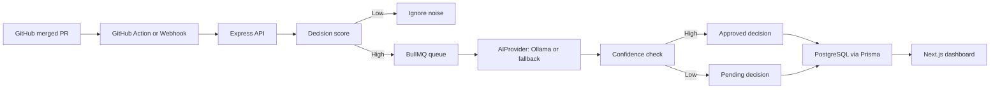

# DecisionCapture

DecisionCapture is an engineering memory system that captures important technical decisions from merged GitHub pull requests.

Code shows what changed. PR discussions explain why. DecisionCapture preserves that reasoning before it disappears into old GitHub threads.

## What It Does

- Accepts merged PR context from GitHub webhooks or the included GitHub Action.
- Scores PRs before AI analysis so low-value noise is ignored.
- Extracts decision, reason, alternative, impact, author, source PR, confidence, and category.
- Stores approved and pending decision memories in PostgreSQL.
- Processes capture work asynchronously with BullMQ and Redis.
- Uses an `AIProvider` abstraction with Ollama plus a deterministic local fallback.
- Provides a SaaS-style dashboard for search, detail review, and pending approval.

## Architecture



## Repository Layout

```text
decisioncapture/
  apps/
    backend/      Express, Prisma, BullMQ, GitHub ingestion, AI extraction
    frontend/     Next.js dashboard, search, detail, pending review
  packages/
    shared/       Shared TypeScript contracts
  .github/
    workflows/    GitHub Action for merged PR ingestion
```

## Quick Start With Docker

Docker is the easiest path. It does not require a local `.env` file because `docker-compose.yml` provides the service environment.

```bash
cd /Users/tausif/Documents/projects/decisioncapture
docker compose up -d
```

Open:

- Frontend: http://localhost:3088
- Backend health: http://localhost:4000/health

Run the local demo PR:

```bash
curl -X POST http://localhost:4000/demo/pr
```

The worker will process a fake merged PR and the dashboard will show an approved decision: “Use a Redis-backed queue for asynchronous PR analysis”.

Stop the stack:

```bash
docker compose down
```

Reset all local demo/test data:

```bash
docker compose down -v
docker compose up -d
```

## Local Development

```bash
cd /Users/tausif/Documents/projects/decisioncapture
cp .env.example .env
npm install
npm run db:generate
npm run dev
```

For non-Docker development, provide PostgreSQL and Redis matching `.env.example`, or point `DATABASE_URL` and `REDIS_URL` at your own services. The Docker Compose database and Redis are intentionally private to the Compose network to avoid local port conflicts.

## Environment Variables

| Variable | Purpose |
| --- | --- |
| `DATABASE_URL` | PostgreSQL connection string for Prisma. |
| `REDIS_URL` | Redis connection string for BullMQ. |
| `QUEUE_MODE` | `inline` for local direct processing, `bullmq` for queued processing. |
| `QUEUE_WORKER_ENABLED` | Starts the worker inside the backend process when true. |
| `GITHUB_WEBHOOK_SECRET` | HMAC secret for GitHub webhook signature verification. |
| `INGEST_API_TOKEN` | Optional token required by `/decisions/analyze`. |
| `AI_PROVIDER` | `ollama` or `heuristic`. |
| `OLLAMA_BASE_URL` | Ollama API URL. In Docker this is `http://ollama:11434`. |
| `OLLAMA_MODEL` | Ollama model name, default `llama3.1`. |
| `USE_HEURISTIC_AI_FALLBACK` | Falls back to deterministic extraction if Ollama is unavailable. |
| `NEXT_PUBLIC_API_URL` | Browser-facing backend URL for the frontend. |

To use a real Ollama model in Docker:

```bash
docker compose exec ollama ollama pull llama3.1
```

The MVP still works before that pull because the backend falls back to the heuristic provider.

## API

- `POST /github/webhook` receives GitHub `pull_request.closed` events and only analyzes merged PRs.
- `POST /decisions/analyze` analyzes full PR context from the GitHub Action or manual ingestion.
- `GET /decisions` searches decisions by keyword, status, repository, category, and sort.
- `GET /decisions/stats` returns dashboard metrics and recent decisions.
- `GET /decisions/:id` returns a decision detail record.
- `PATCH /decisions/:id/approve` approves a pending decision and optional edits.
- `PATCH /decisions/:id/reject` rejects a pending decision.
- `POST /demo/pr` queues a sample merged PR for local demo testing.

## GitHub Integration

The included workflow runs only for:

```yaml
pull_request:
  types: [closed]
```

It also checks:

```yaml
if: github.event.pull_request.merged == true
```

Configure repository secrets:

- `DECISIONCAPTURE_API_URL`, for example `https://your-api.example.com`
- `DECISIONCAPTURE_TOKEN`, matching `INGEST_API_TOKEN`

If you want to test this from a local machine, expose the backend with a tunnel and use that public URL as `DECISIONCAPTURE_API_URL`.

For direct webhooks, set the GitHub webhook secret to match `GITHUB_WEBHOOK_SECRET`.

## Verification

Commands run successfully during this build:

```bash
npm run typecheck
npm run lint
npm run test
npm run build
docker compose config
docker compose build backend frontend
docker compose up -d
curl http://localhost:4000/health
curl -X POST http://localhost:4000/demo/pr
curl http://localhost:4000/decisions
```

The dashboard was also verified in the in-app browser at `http://localhost:3088`: stats rendered, the Redis queue decision appeared, search for `Redis` worked, and the decision detail page opened without console errors.

## Future Memory Store MCP Integration

DecisionCapture is standalone today. A future integration can export approved decision memories into Memory Store MCP:

```text
DecisionCapture -> Memory Store MCP -> Company Memory
```

That integration should be an optional output adapter. The core MVP does not depend on Memory Store APIs.
